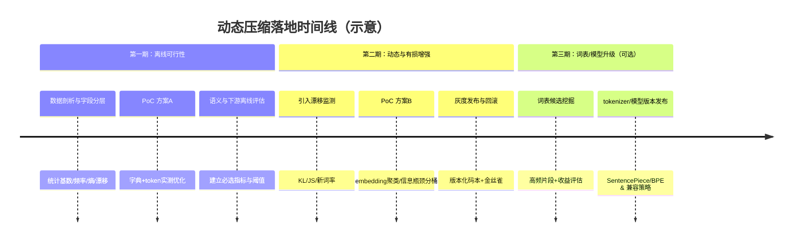

# Stage3 研究备注（占位）

此文件为 Stage3 方案 A 的研究占位文档。  
完整可运行实现与数学说明请见：

- `stage3/README.md`
- `stage3/literal_codec/`
- `stage3/tests/`

当前实现范围：

- 字段级分布估计（经验分布 + Lidstone/Laplace）
- 自信息与熵分析
- Token 成本评估
- 候选短码池（best-first）
- Trie 前缀约束与可逆编码
- 离线构建、报告输出、CLI/demo、测试

后续扩展占位：

- 方案 B：语义损失模型（近似压缩）
- 方案 C：漂移检测与字典版本切换
# 基于自信息的 Stage3 自变量动态压缩方案研究报告

## 执行摘要

**未指定项（按“未指定”处理）**：Stage3 的自变量类型（未指定）、数据规模（未指定）、实时/离线约束（未指定）。

本报告面向“在 Stage3 对自变量做基于自信息（surprisal）的动态压缩”的工程目标：**在最大化 token 节省的同时，最小化语义损失**。核心思想是把 Stage3 自变量视为信息源，对其取值的概率分布进行估计，用自信息 \(I(x)=-\log p(x)\) 给“罕见/意外”的值更高优先级，再结合熵 \(H\)、条件熵 \(H(\cdot|\cdot)\)、互信息 \(I(\cdot;\cdot)\) 判断冗余与重要性，进而在“分块→编码→在线更新”链路上做**码长/词表资源的动态预算分配**。信息论给出无损压缩的理论下界（源编码定理：平均码长不能低于熵）以及有损压缩的经典折衷框架（率失真理论、信息瓶颈）。citeturn0search1turn8search2turn8search4turn8search1

在未明确“能否改 tokenizer/模型”和“是否必须无损”的前提下，报告给出可落地的三类方案，并在结论中按不同约束排序推荐：

- **方案 A（优先，低风险，近似无损）**：以“字段级字典 + 自信息驱动的码长分配”为主，针对高频取值做短码（可用 Huffman/算术编码思想），并用**实际 tokenizer 的 token 计数**作为优化目标（而不是仅用 bit）。适合取值域相对有限或模板化自变量。citeturn3search0turn3search1turn10search6turn8search2  
- **方案 B（次优，有损但语义可控）**：引入互信息/信息瓶颈做“语义相关的聚类分桶”，把大量长尾取值映射到少量“语义簇码”，以 embedding 距离与下游指标约束语义损失；适合高基数、长尾、重复率低但语义相近的自变量。citeturn8search1turn9search0turn7search3turn5search11  
- **方案 C（节省最强但成本最高）**：若 Stage3 使用自研/可微调模型，进行 tokenizer/词表再训练或扩充（BPE/Unigram/SentencePiece），把高频“字段-值片段”直接变成单 token；对 token 节省最直接，但涉及模型与服务版本升级。citeturn3search3turn4search4turn10search1turn10search0  

## 问题背景与目标定义

Stage3 的工程语境通常是：上游系统已产生一组自变量（可理解为**特征字段、结构化键值、检索结果、上下文片段或描述性文本**），Stage3 需要把它们以某种序列化形式输入到下游模型/LLM 或存入中间表示。此时 token 成本（上下文长度、推理延迟、调用计费、吞吐）往往成为瓶颈，而简单截断又会造成语义或决策性能下降。citeturn10search6turn3search3turn4search4

在本报告中，我们把“压缩”理解为：把原始自变量集合 \(X=\{X_1,\dots,X_m\}\) 变换为更短的表示 \(Z\)（可能是字符串序列/token 序列/离散码/量化码），并在必要时可逆（无损）或近似可逆（有损）。目标可以形式化为多目标优化：

- **token 节省最大化**：最小化期望 token 数 \( \mathbb{E}[\mathrm{TokLen}(Z)]\)（实践上必须用目标模型的 tokenizer 真实计数）。citeturn10search6turn10search2  
- **语义损失最小化**：最小化某种语义损失 \( \mathcal{L}_\mathrm{sem}(X,\hat X)\) 或下游性能损失 \( \Delta\mathrm{Perf}\)。  
- **约束（未指定）**：实时/离线、是否允许更新 tokenizer、是否必须可逆、是否允许字段级不同失真预算等均未指定。本报告将同时给出“固定 tokenizer 的外部系统路径”和“可变 tokenizer 的自研模型路径”。citeturn4search4turn10search0turn10search14

一个常用的折衷写法是拉格朗日形式（与率失真/信息瓶颈思想一致）：  
\[
\min \; \mathbb{E}[\mathrm{TokLen}(Z)] \;+\; \lambda \cdot \mathbb{E}[\mathcal{L}_\mathrm{sem}]
\]
其中 \(\lambda\) 代表“语义重要性”权重，可按字段、请求类型或下游任务动态调整。率失真理论与信息瓶颈都提供了类似“受限码率下保真度最大化/相关信息最大化”的原则性框架。citeturn8search4turn8search1

## 信息论基础与重要性度量

**自信息（Self-information / surprisal）**定义为某个结果 \(x\) 的信息量：
\[
I(x) = -\log_b p(x)
\]
底数 \(b=2\) 时单位为 bit；\(p(x)\) 越小，\(I(x)\) 越大，代表“越意外越有信息”。citeturn0search0turn0search1

**香农熵（Shannon entropy）**是随机变量平均自信息：
\[
H(X) = \mathbb{E}[I(X)] = - \sum_{x} p(x)\log_b p(x)
\]
它刻画了在无损编码下**平均最少需要多少信息量**（源编码定理给出近似下界意义）。citeturn0search1turn8search2

**条件熵（Conditional entropy）**刻画已知 \(Y\) 后 \(X\) 的剩余不确定性：
\[
H(X|Y)= -\sum_{x,y} p(x,y)\log p(x|y)
\]
它直接用于判断“字段之间的冗余”：若 \(H(X_i|X_j)\) 很小，说明 \(X_i\) 在已知 \(X_j\) 时几乎可预测，可考虑更强压缩甚至省略。citeturn0search12turn0search15

**互信息（Mutual information）**刻画两个变量共享的信息量：
\[
I(X;Y)=\sum_{x,y} p(x,y)\log \frac{p(x,y)}{p(x)p(y)}=H(X)-H(X|Y)
\]
也可写为 \(I(X;Y)=D_\mathrm{KL}(p(x,y)\|p(x)p(y))\)，因此 \(I(X;Y)\ge 0\)，且独立当且仅当互信息为 0。citeturn0search8turn8search3

### 如何衡量单个自变量与集合的重要性

把 Stage3 自变量视为字段集合 \(X_1,\dots,X_m\)。常见的“重要性”信号包括：

- **字段内部的熵 \(H(X_i)\)**：若一个字段取值分布极集中（低熵），它对区分样本/语义贡献可能有限，但对“高频短码”非常友好（短码收益高）。反之高熵字段更“信息丰富”，但也更难压缩。citeturn0search1turn8search2  
- **字段间冗余 \(I(X_i;X_j)\) 或 \(H(X_i|X_{-i})\)**：若某字段对其他字段几乎可预测，则可以弱化其编码（更短码、更粗分桶）而不显著损失整体信息。citeturn0search8turn0search12  
- **与“相关变量” \(Y\) 的互信息 \(I(X_i;Y)\)**：如果存在可定义的下游目标（例如最终标签、检索相关性、LLM 输出质量 proxy），则应优先保留对 \(Y\) 有贡献的字段（最大相关、最小冗余可用 mRMR 思想近似）。citeturn9search1turn9search5  
- **点态重要性（per-instance）**：同一字段在不同请求中，“取值的自信息”不同。动态压缩可用 \(I(x)\) 做实例级预算：对“罕见且关键”的值分配更长、更保真的编码。citeturn0search0turn0search1  

### 中文示例：用自信息与条件熵解释“该短就短、该长就长”

设字段 \(X=\)“用户问题类型”，分布为：  
- “售后” 0.6，“价格” 0.3，“投诉” 0.1。  

则自信息：  
- \(I(\text{售后})=-\log_2 0.6\)（较小），  
- \(I(\text{投诉})=-\log_2 0.1\)（较大）。citeturn0search0turn0search1  

编码策略含义：对“售后”这样的高频值给短码（1 token 或极短串），对“投诉”给相对长码更合理——这与 Huffman 编码“高频符号短码、低频符号长码”的最小冗余原则一致。citeturn3search0turn6search3  

再设字段 \(Y=\)“是否需要转人工”，若已知“投诉”几乎必转人工，则 \(I(X;Y)\) 很高，此类取值应更保真；若某字段在已知其他字段后几乎可推出（低 \(H(\cdot|\cdot)\)），则可以更强压缩。citeturn0search8turn0search12turn9search1  

## 熵估计与 token 成本评估方法

动态压缩的第一步是**估计分布与信息量**。但 Stage3 自变量可能包含离散、连续、文本、向量等多种类型，熵估计策略应分层选型。熵与互信息估计在小样本、高基数条件下会产生显著偏差与方差，属于“经典但易踩坑”的环节。citeturn1search0turn2search16

### 熵估计方法对比

下表按“自变量类型/可得信息/计算成本”总结常用估计法（以实践可落地为导向）：

| 方法族 | 代表做法 | 优点 | 局限 | 适用场景 |
|---|---|---|---|---|
| 经验熵 / 频率法 | \(\hat p(x)=c(x)/N\) 后直接算 \(H\) | 简单、可解释、易流式更新 | 对长尾/高基数偏差大；小样本下不稳 | 中低基数离散字段；高频值短码设计前的粗估 |
| 平滑/修正 | Laplace、Good-Turing、Jelinek–Mercer 等 | 缓解零计数；对 n-gram 类特别实用 | 参数敏感；仍不解决极高基数的根本问题 | 文本片段的 n-gram 概率估计、稀疏计数场景 citeturn1search1turn1search17 |
| 极大似然（MLE）与偏差分析 | MLE 估计 + 偏差校正讨论 | 有理论分析框架 | 在 undersampled 时仍可能失真 | 有足够样本、需要理论边界时 citeturn1search0 |
| 贝叶斯估计 | Dirichlet/KT、NSB 等 | 对小样本与高基数更稳；可给不确定度 | 计算成本更高；先验选择影响结果 | 高基数离散字段、长尾严重；需要稳健熵估计 citeturn2search0turn2search1turn2search16turn2search12 |
| 压缩基估计（universal coding） | LZ/CTW 等压缩率近似熵率 | 无需显式建模；适合序列熵率 | 只能给“序列熵率”近似；与具体 tokenizer token 不等价 | 把字段串联成序列、评估整体可压缩性/冗余 citeturn2search3turn2search2turn2search15 |
| 基于语言模型的熵近似 | 用 LM 交叉熵/困惑度近似 surprisal | 更贴近“语义与上下文”；适用开放词表文本 | 依赖模型；与特定 tokenizer 强耦合 | 文本型自变量、语义保真评估的 proxy（尤其有损压缩） |
| 基于 embedding 的信息量近似 | kNN 互信息估计（KSG）等 | 适用连续/向量；可估计 MI | 高维下样本需求大；实现复杂 | 需要衡量“语义向量”与下游变量的依赖 citeturn1search3turn1search7 |

### 推荐用于“token 节省评估”的方法：以真实 tokenizer 为准，再用熵做下界与诊断

信息论的 bit 下界并不直接等于 LLM 的 token 数（token 由 tokenizer 决定，且每 token 携带的信息量不恒定）。因此对“token 节省”最可靠的评估应当是：

1) **对每个候选编码方案生成实际字符串表示** \(Z\)。  
2) 用目标系统的 tokenizer 直接计算 \(\mathrm{TokLen}(Z)\) 的分布与期望，并以此作为主指标。citeturn10search6turn10search2turn10search14  
3) 同时计算字段/整体的熵 \(H\) 或熵率，作为**理论下界与改进空间诊断**：若实际 token 成本远高于熵下界，说明“编码字符集/词表设计”还有显著优化余地；若已接近下界，则需要转向“允许有损”的方向才能进一步降低成本。citeturn8search2turn2search3turn3search1  

这种“token 实测为主、信息论为辅”的组合，既满足工程可比性，也避免把 bit 与 token 生硬等同。citeturn10search6turn8search2

## 分块策略与压缩编码方案设计

“分块”决定了压缩的粒度（字段级、字段组级、样本级），直接影响：可压缩冗余能否被利用、解码可行性、在线更新成本与语义损失形态。以下给出至少三类分块策略，并为每类给出步骤、复杂度、参数与优缺点。

### 基于熵阈值的分块

**思想**：把字段或字段-取值对按信息量排序，把有限的“token 预算/码本容量”优先分配给能带来最大收益的部分。常用于先做一轮“收益最大化”的粗分块。

**算法步骤（字段级）**  
1) 对每个字段 \(X_i\) 估计边际分布与熵 \(H(X_i)\)，或估计其高频取值集合的累计概率质量 \(P_{\mathrm{top}}\)。citeturn1search0turn2search1  
2) 计算“编码收益”指标，例如：若把 top-K 取值映射为短码，预期 token 节省 \(\Delta_i\)（用 tokenizer 实测）。citeturn10search6  
3) 按 \(\Delta_i\) 或 \(\Delta_i/\mathrm{cost}\) 排序，依次加入块，直到达到预算（最大字典大小、最大 token 节省前 N 项、或最大内存）。  
4) 每个块内部用相同策略编码；块与块之间用分隔符/字段标签保证可解析。

**复杂度**：计数与估计 \(O(N)\)，排序 \(O(m\log m)\)（\(m\)=字段数），token 实测成本取决于候选数。  

**参数**：预算 \(B\)、top-K、最小支持度 \(c_{\min}\)、分隔符策略。  

**优点**：简单、可解释、上线风险低；可快速把“最重复的值”压下去。  
**缺点**：无法显式利用字段间依赖；对长尾与语义相近值帮助有限。citeturn1search0turn8search2  

### 基于互信息的聚类分块（含信息瓶颈/AIB）

**思想**：把字段看作随机变量图，按互信息把强依赖的字段聚为一块，以便在块内做联合编码（利用条件熵降低总码长）；若存在相关变量 \(Y\)，用信息瓶颈或 AIB（Agglomerative Information Bottleneck）做“相关信息保留最大化”的聚类。citeturn8search1turn9search0turn0search8

**算法步骤（无监督字段聚类）**  
1) 估计两两互信息矩阵 \(M_{ij}=I(X_i;X_j)\)（离散可用分箱/贝叶斯，连续/向量可用 kNN MI）。citeturn1search0turn1search7turn0search8  
2) 构建相似图（边权=互信息或归一化互信息），对图做社区发现或层次聚类得到字段簇。  
3) 每个字段簇作为一个块，在块内做联合建模（如条件概率链、块级字典）。  

**算法步骤（有监督/有相关变量 \(Y\)）**  
1) 把每个字段或字段取值表示为“关于 \(Y\) 的条件分布/响应统计”。  
2) 用信息瓶颈目标：在压缩表示 \(T\) 的同时最大化 \(I(T;Y)\)、最小化 \(I(T;X)\)。citeturn8search1  
3) 用 AIB 做贪心自底向上合并，得到层次分块树，可在不同码率下截断选择块数。citeturn9search0turn9search4  

**复杂度**：两两互信息估计通常 \(O(m^2)\) 起步；AIB/层次聚类也通常需要 \(O(m^2)\) 级别的合并过程（实现细节不同）。citeturn9search0turn1search0  

**参数**：互信息阈值、簇数/树截断层、MI 估计法参数（kNN 的 \(k\)、离散分箱数）、信息瓶颈的 \(\beta\)（压缩-相关权衡）。citeturn8search1turn1search7  

**优点**：能显式利用冗余，理论动机强；有 \(Y\) 时更能对齐下游效果。  
**缺点**：计算更重；MI 估计对样本量敏感；在线更新更复杂。citeturn1search0turn1search7turn8search1  

### 基于语义 embedding 的聚类分块

**思想**：当字段值是文本（短语、实体名、检索片段）或可映射为 embedding 时，用语义相似度把值聚成簇，从而以“簇码”替代原值（有损）或以“簇内字典”减少 token（近似无损）。语义 embedding 的相似搜索与聚类可借助向量索引库加速。citeturn7search3turn9search2

**算法步骤（值级聚类）**  
1) 为每个取值 \(v\) 计算 embedding（如句向量），得到 \(e(v)\)。citeturn7search3turn7search7  
2) 用 k-means/层次聚类/近邻图聚类得到簇 \(C_1,\dots,C_K\)。  
3) 设计编码：  
   - 有损：输出簇 ID +（可选）簇中心代表短语；  
   - 近似无损：簇内再做稀疏字典或短码，未知值回退原文。  
4) 用 embedding 距离与下游指标约束簇内误差与簇数。citeturn7search3turn9search2  

**复杂度**：embedding 计算通常是主要成本；聚类训练 \(O(VKdI)\)（\(V\)=不同取值数，\(d\)=向量维度，\(I\)=迭代），大规模需 ANN/分批；在线查询可用向量索引实现亚线性近邻搜索。citeturn7search3turn9search2  

**参数**：簇数 \(K\)、相似度阈值、embedding 模型、ANN 索引参数（如 IVF/HNSW 等）。citeturn9search2  

**优点**：对长尾文本有效；可把“同义/近义”合并为更短表示。  
**缺点**：天然有损（除非保留回退原文）；需要额外模型与在线算力。citeturn7search3turn9search2  

### 分块策略小结表

| 策略 | 最适合的自变量形态 | 典型收益来源 | 上线风险 | 计算/实现成本 |
|---|---|---|---|---|
| 熵阈值分块 | 离散字段、多高频重复 | 把高频值变短码 | 低 | 低 |
| 互信息分块 | 字段间强依赖、可定义 \(Y\) | 利用条件熵/相关信息保留 | 中 | 中高 citeturn8search1turn9search0 |
| embedding 分块 | 高基数文本/长尾语义 | 语义聚类降维、簇码替代 | 中高 | 高 citeturn7search3turn9search2 |

### 压缩与编码方案对比与“自信息优先级”的落地

Stage3 的“token 压缩”可从两层理解：

1) **信息论意义上的码长（bit）最优**：Huffman/算术编码把平均码长逼近熵下界。citeturn3search0turn3search1turn8search2  
2) **LLM 意义上的 token 最优**：需要让最终字符串在目标 tokenizer 下产生更少 token，因此编码字符集、分隔符、短码串的形态、甚至 tokenizer 的词表都很关键。citeturn10search6turn10search1turn4search4  

下表比较题目要求列举的若干技术，并给出“与自信息结合”的方式：

| 技术 | 主要作用层 | 自信息如何驱动 | 优点 | 局限 |
|---|---|---|---|---|
| 词表缩减 | tokenizer/模型层 | 去掉低频 token，把容量让给高频片段 | 可能减少长尾噪声 | 需训练/适配模型；不适合外部固定 tokenizer citeturn4search4turn10search0 |
| 子词/BPE | tokenizer/模型层 | 高频子串优先进入子词表；罕见词分解为多子词 | 开放词表、减少 OOV；常用且稳定 | 需重训 tokenizer；对字段结构化串不一定最优 citeturn3search3turn4search10 |
| SentencePiece/Unigram | tokenizer/模型层 | 选取使整体似然最大的子词集合；可更灵活处理空格/语言 | 端到端、语言无关，可直接从原句训练 | 同样涉及 tokenizer 与模型适配 citeturn4search4turn10search1turn10search16 |
| Huffman 编码 | bit 编码层 | 码长 \(\ell(x)\approx I(x)\)：高频短码、低频长码 | 前缀码最小冗余；实现简单 | bit 串如何映射为“少 token 字符串”需额外设计 citeturn3search0turn6search3 |
| 算术编码 | bit 编码层 | 按概率模型逐符号编码，平均更接近熵 | 可适配自适应模型，接近最优 | 需要精确概率模型与实现细节；同样存在 token 映射问题 citeturn3search1 |
| 量化 / 向量量化 | 向量/连续值层 | 高密度区域更短码；可做自适应码本 | 大幅压缩 embedding/数值表示 | 有损，需定义语义损失；解码误差不可忽略 citeturn6search0turn5search14 |
| 稀疏化 | 向量/模型层 | 保留高自信息/高贡献维度，其余置零 | 计算与存储双降 | 可能破坏语义；需稀疏索引与兼容 citeturn5search1turn6search2 |
| 字典学习 | 表示学习层 | 用少量原子表示常见结构，罕见部分残差编码 | 对结构化信号压缩强 | 训练复杂；在线更新难 citeturn6search1 |
| 模型蒸馏 | 模型层 | 把“解释/编码能力”压缩到小模型支撑在线压缩 | 降延迟、降成本 | 不是直接 token 压缩，需要配合编码机制 citeturn5search0 |
| 语义哈希 | 语义表示层 | 用短二进制码表示语义相近文档/值 | 检索快、码长固定可控 | 有损；训练/碰撞控制是关键 citeturn5search11 |

#### 关键落地问题：如何把“bit 码长最优”转成“token 最优”

若 **无法改 tokenizer**（典型外部 API/固定模型），建议把 Huffman/算术编码的思想用于“**码长预算分配**”，但最终码字不是 bit 串，而是从候选短字符串集合中挑选，使 **token 长度最小**：

- 先得到每个符号的目标相对码长（从概率或自信息来），再在特定 tokenizer 下搜索“实际 token 长度最短、且可唯一解码”的码字集合。  
- 这本质上是一个带约束的码字设计问题：成本函数从“bit 长度”变为“token 长度”。工程上可用启发式：短码池（若干极易被 tokenizer 合并的短片段）+ 前缀约束 + 版本化字典。citeturn3search0turn10search6turn8search2

若 **可以改 tokenizer/模型**（自研或可微调），则直接走 **方案 C**：把高频字段片段（例如“字段名=”“常见枚举值”“固定格式日期前缀”等）加入子词表，使其成为单 token 或少 token，从源头减少 TokLen。citeturn4search4turn10search1turn3search3  

### 编码/解码流程图与伪代码

下面给出一个“分块 + 自信息优先级 + 版本化码本”的通用流程（既可无损，也可有损，取决于映射是否可逆）。

```mermaid
flowchart LR
  A[输入: 一条样本的自变量 X] --> B[分块器: 得到块 B1..Bk]
  B --> C[块内统计/概率模型 p(·)]
  C --> D[码本生成: 依据自信息分配码长]
  D --> E[选择码字: 以 token 长度为成本]
  E --> F[编码器: 输出 Z(含字典版本 v)]
  F --> G[下游 Stage3/LLM/存储]

  F --> H[解码器]
  H --> I[还原 X 或近似 X_hat]
```

该流程的理论动机来自：自信息/熵定义与源编码下界；Huffman/算术编码提供“按概率分配码长”的经典构造；而 token 计数提供工程上真实成本。citeturn0search1turn8search2turn3search0turn3search1turn10search6

简化伪代码（以字段值字典编码为例）：

```text
# 训练/更新阶段（离线或准实时）
input: 历史样本集 D, 目标tokenizer T, 预算 B
for each 字段 Xi:
    统计频数 c(v), 得到 p(v) (可加平滑/贝叶斯)
    计算自信息 s(v) = -log p(v)
    选择需要短码的集合 Top = {v | c(v) >= c_min 且节省潜力大}
    生成目标码长(可用 Huffman 思想): len_target(v) ∝ s(v)
    在候选短字符串集合 S 里搜索码字 code(v),
        使 TokLen_T(code(v)) 最小并满足可唯一解码
输出: 版本化码本 Dict_v 以及回退规则

# 在线编码
encode(x):
    输出头部: v
    for each 字段 Xi:
        if value v in Dict_v:
            append code(v)
        else:
            append escape + 原文/近似表示
    return Z

# 在线解码
decode(Z):
    读 v，加载 Dict_v
    逐字段解析 code -> value 或回退解析
    return X 或 X_hat
```

## 语义损失度量与多目标优化

token 节省是“硬成本”，语义损失则取决于 Stage3 的用途：若 Stage3 最终喂给 LLM 做推理，语义损失通常表现为输出质量下降；若 Stage3 是检索排序/分类特征，语义损失表现为指标下降。为保持严谨，建议把语义损失拆成“可逆性、语义相似、任务可用性”三层，并做多目标优化。

### 语义损失指标对比

| 指标族 | 定义与直觉 | 优点 | 局限 | 典型适用 |
|---|---|---|---|---|
| 重构误差（无损/近似无损） | exact match、编辑距离、字段级一致率 | 对结构化字段最直接 | 对“同义改写”过于苛刻 | 无损压缩、需可审计字段 |
| embedding 距离 | \(\|e(x)-e(\hat x)\|\)、余弦距离 | 更贴近语义 | 依赖 embedding 模型 | 文本字段有损压缩；语义聚类 citeturn7search3turn7search7 |
| 生成质量指标 | BLEU、ROUGE 等 n-gram 重合 | 可自动化对比参考答案 | 对语义等价不敏感或不充分 | 有参考答案的 NLG/摘要任务 citeturn7search0turn7search1 |
| 语义匹配指标 | BERTScore 等基于上下文嵌入对齐 | 与人工相关性更好 | 计算成本更高 | 有参考文本的语义保真评估 citeturn7search2 |
| 下游任务性能 | Accuracy、AUC、NDCG、人工评分等 | 最终目标一致 | 需要在线/离线任务闭环 | Stage3 面向具体任务时最权威 |
| 互信息损失 | \(\Delta I(Z;Y)\) 或 \(\Delta I(X;Z)\) | 与信息瓶颈/率失真一致 | \(Y\) 未必可得且估计难 | 有明确相关变量/标签时 citeturn8search1turn0search8 |

### token 节省与语义损失的折衷优化

建议采用“两层优化”：

1) **硬约束层**：对关键字段设定“最大允许语义损失”或“必须无损”的约束（例如 ID、金额、时间戳等）。  
2) **预算分配层**：对可有损字段做拉格朗日优化或 Pareto 前沿搜索，得到不同 \(\lambda\) 下的方案族。率失真理论把“码率—失真”折衷系统化；信息瓶颈把“压缩—相关信息保留”系统化，适合把 \(Y\) 设为下游信号。citeturn8search4turn8search1  

下图用示例数据展示“token 节省 ↑ 通常伴随语义损失 ↑”的 Pareto 直观（点位仅为示意，实践需以真实测量填充）：

```mermaid
xychart-beta
  title "示意：Token 节省 vs 语义损失（越低越好）"
  x-axis "Token 节省(%)" 0 --> 60
  y-axis "语义损失(归一化)" 0 --> 1.0
  scatter
    "A:字典+短码(近似无损)" : [20, 0.05]
    "B:语义聚类(有损)" : [45, 0.35]
    "C:词表扩充(强节省)" : [55, 0.12]
```

## 动态在线框架、实验设计与实施建议

动态压缩的难点不在“做一次压缩”，而在**在线分布漂移、字段语义漂移、码本版本兼容与回滚**。因此需要一个把统计、评估、发布与回滚闭环化的框架。

### 动态/自适应压缩框架与系统架构

核心机制包括：

- **实时监测**：监测字段分布漂移（例如用 KL/JS 衡量新旧分布差异）、token 成本漂移、语义相似/下游性能漂移。KL 散度提供了“用错分布编码的额外代价”的信息论解释，也常用于漂移度量。citeturn8search3  
- **触发重分块/重编码**：当漂移超过阈值或 token 成本上升，触发离线或准实时的重训练：更新分块、更新码本、必要时更新词表。citeturn1search0turn9search0  
- **在线更新与回滚**：码本必须版本化；编码输出携带版本号；解码服务保留旧版本以兼容历史数据；发布采用灰度/金丝雀，异常则快速回滚到上一版本。  

```mermaid
flowchart TB
  subgraph Online[在线路径]
    R[请求/样本进入] --> E[编码服务<br/>字典查表+快速规则]
    E --> Z[压缩表示 Z(v)]
    Z --> Dn[下游 Stage3/LLM/存储]
  end

  subgraph Monitor[监测与评估]
    Z --> S[流式统计器<br/>频数/新词/漂移]
    Dn --> P[质量监控<br/>下游指标/人工抽检]
    S --> A[触发器<br/>漂移阈值/成本阈值]
    P --> A
  end

  subgraph Offline[离线/准实时更新]
    A --> T[训练管线<br/>熵估计/互信息/聚类]
    T --> V[生成新码本/新分块<br/>版本 v+1]
    V --> C[离线回放评估<br/>token&语义&性能]
    C --> G[灰度发布/回滚策略]
    G --> E
  end
```

上述框架把“概率模型—编码—评估”分离，符合算术编码强调的“模型与编码器分离、易做自适应模型”的工程理念；同时也兼容 Huffman 这类离线构造码本的方式。citeturn3search1turn3search0  

### 延迟与计算成本估计（数量级）

在未指定实时性约束时，给出可用于容量规划的数量级拆解（以“每条请求编码一次”为例）：

- **字典查表/字段模板化压缩（方案 A）**：通常是 \(O(m)\) 次哈希查找与拼接，单机毫秒级甚至亚毫秒级可达。  
- **互信息/embedding 驱动（方案 B）**：在线若需要实时 embedding，成本取决于模型与部署方式；工程上常用“离线聚类 + 在线查表/ANN 检索”把在线成本降到近似查表（ANN 依赖索引结构）。向量检索与聚类可用专用库加速。citeturn9search2turn9search6  
- **词表/模型更新（方案 C）**：主要成本在离线训练与版本发布；在线推理 token 数下降会带来稳定的延迟与成本收益，但上线门槛最高。citeturn4search4turn10search1turn3search3  

### 词表扩充与扩展策略

当且仅当满足下列至少一条条件时，才建议走“词表扩充/重训 tokenizer”（因为它是高收益但高成本/高风险的选择）：

- 你能控制 Stage3 下游模型（自研、可微调、允许升级），并且 token 成本是明确瓶颈。citeturn4search4turn10search1  
- 在固定 tokenizer 下，已经做过字典短码，但“token 成本—熵下界差距仍很大”，说明编码串无法被 tokenizer 高效吸收。citeturn8search2turn10search6  
- 自变量存在大量稳定的高频片段（如字段名、常见枚举、固定格式前缀）且跨请求复用度高，适合变成单 token。citeturn3search3turn4search4  

**新增 token/子词选择策略（自动化）**建议采用“语义收益—token 成本”打分：

- 候选片段来源：高频 n-gram、字段名-值的固定连接串、检索模板片段、单位/格式前缀等。citeturn3search3turn4search4  
- token 成本：加入前后分别用 tokenizer 统计 TokLen 的变化。citeturn10search6turn10search2  
- 语义收益：下游任务提升、或语义损失指标下降（embedding 距离、BERTScore 等）。citeturn7search2turn7search3  
- 选择规则：在预算（新增 token 数、模型大小、训练时长）内，最大化 \(\Delta\mathrm{TokSavings} - \alpha\Delta\mathrm{SemLoss}\)。  

实现上，SentencePiece 提供从原始句子直接训练子词模型（BPE 或 Unigram）并配套 detokenizer，适合作为“可控 tokenizer 管线”的基础组件。citeturn4search4turn10search1turn10search16  

### 实验设计与评估

为保证“严谨、可复现、能上线”，建议做离线 + 在线两阶段评估，并明确基线。

**离线实验**（回放历史数据）  
- 数据：按时间切分训练/验证/测试，并额外建立“漂移集”（最近窗口）。数据规模未指定，因此建议同时报告样本数、不同字段基数与长尾程度。citeturn1search0turn2search16  
- 基线：  
  - 原始表示（不压缩）；  
  - 固定规则压缩（如仅去冗余空白、数值格式化）；  
  - 固定 BPE/固定字典（不动态更新）。citeturn3search3turn10search0  
- 指标：  
  - token：平均/分位 TokLen、节省百分比；  
  - 语义：重构率、embedding 距离、BERTScore/BLEU/ROUGE（视任务而定）；  
  - 下游：任务指标（AUC/NDCG/人工评估）；  
  - 资源：编码耗时、内存、码本大小。citeturn10search6turn7search2turn7search0turn7search1  

**在线实验**（A/B 或灰度）  
- 以用户请求为单位做 A/B：对照组用旧编码，实验组用新编码；观测 token 成本、延迟、下游指标与失败率；必要时加入人工抽检。  
- 引入“回滚阈值”：如下游关键指标下降超过阈值或解码失败率上升，即回滚版本。  

建议的结果表格格式（示例模板）：

| 方案 | 是否可逆 | TokLen 均值 | TokLen P95 | Token 节省% | 语义损失（选1-2个主指标） | 下游指标变化 | 编码延迟(ms) | 码本内存 | 备注 |
|---|---|---:|---:|---:|---:|---:|---:|---:|---|
| Baseline 原始 | 是 |  |  | 0 | 0 | 0 |  |  |  |
| A 字典+短码 | 是/近似是 |  |  |  |  |  |  |  |  |
| B 语义聚类簇码 | 否 |  |  |  |  |  |  |  |  |
| C 词表扩充 | 视实现 |  |  |  |  |  |  |  |  |

### 时间线建议（从 PoC 到上线）



### 实施建议与风险

**工程要点**  
- **以 tokenizer 实测为“真目标函数”**：即使采用 Huffman/算术编码思想，也必须把“码字在目标 tokenizer 下的 token 长度”纳入搜索/选择。token 计数可用公开工具链完成。citeturn10search6turn10search2turn10search14  
- **版本化与可回滚是硬要求**：编码输出必须携带码本版本；解码端需至少保留一段时间的旧版本；发布走灰度。  
- **分层策略**：先做无损/近似无损（A）打基础，再在长尾部分引入可控有损（B），最后才考虑 tokenizer/模型升级（C）。这符合“先拿到确定性收益，再扩展收益边界”的风险控制原则。citeturn8search2turn8search1  

**可用工具/库（主流与中文资源优先）**  
- token 计数与 tokenizer：官方提供 token 计数示例与工具；开源 BPE tokenizer 可用于离线评估与成本估计。citeturn10search6turn10search2turn10search14  
- tokenizer 训练/扩充：SentencePiece（BPE+Unigram，支持从原始句子训练）、以及主流 tokenizer 教程与对比文档。citeturn10search1turn4search4turn10search0turn10search20  
- 向量聚类/相似搜索：向量检索与聚类库可支撑 embedding 分块与大规模近邻查找。citeturn9search2  
- 通用压缩与字典压缩：若 Stage3 需要对小块数据做二进制压缩与传输，可参考 zstd 的实时压缩与字典压缩机制（注意这解决的是“字节/带宽”，不直接等同 token，但可用于日志/缓存）。citeturn10search15turn3search2turn10search3  

**主要风险与缓解**  
- **分布漂移导致短码失效**：高频变长尾、长尾变高频，会使 token 节省下降；缓解：漂移监测 + 定期再训练 + 灰度发布。citeturn8search3turn1search0  
- **有损聚类带来隐性语义丢失**：尤其对关键实体/数字；缓解：字段分级（关键字段无损）、簇内半保真（簇码+代表短语+必要时回退原文）、以 BERTScore/embedding 距离+下游指标双约束。citeturn7search2turn7search3  
- **词表升级的兼容与回归风险**：tokenizer 改动会影响模型输入分布；缓解：版本化模型、双写双跑、逐步迁移、提供 detokenizer/对齐规则。citeturn4search4turn10search1  

## 结论与推荐

在“自变量类型、数据规模、实时性要求均未指定”的情况下，最稳健的落地路径应优先满足：**可解释、可回滚、可逐步增强**。基于本报告比较，给出 3 个优先方案并排序（在不同约束下有分支）：

**第一优先：方案 A——字段级字典 + 自信息驱动的短码分配（固定 tokenizer 也可用）**  
适用：枚举/类别/模板化文本/重复率较高字段；要求语义几乎不损失或必须可审计。做法是先用频率/贝叶斯估计分布，按自信息排序挑 top 值做短码，并以“真实 tokenizer 的 token 计数”作为码字选择目标，同时做版本化字典与漂移更新。它的理论依据可用源编码与最小冗余编码解释，工程上上线风险最低。citeturn8search2turn3search0turn10search6turn2search1  

**第二优先：方案 B——互信息/信息瓶颈 + embedding 聚类的有损分桶（长尾压缩的主力）**  
适用：高基数、长尾严重、文本化取值多、但语义近似可合并的字段；允许可控语义损失。推荐把 \(Y\) 设为下游信号（若可得）并用信息瓶颈/AIB 思路做“保留相关信息”的聚类，再用 embedding 距离与下游指标限定失真。它对 token 节省上限更高，但需要更强监测与评估闭环。citeturn8search1turn9search0turn7search3turn7search2  

**第三优先（条件满足才做）：方案 C——词表/Tokenizer 扩充或重训（BPE/Unigram/SentencePiece）**  
适用：你能控制 Stage3 下游模型版本，并且 token 成本已成为主要瓶颈。把高频字段片段直接加入词表能“结构性地”减少 TokLen，通常是 token 节省最直接的路线；但它需要模型适配与发布体系（回归测试、版本管理、灰度），工程成本最高。citeturn4search4turn10search1turn3search3turn10search0  

总体建议是：先用方案 A 获得确定性收益与稳定基础设施（统计、版本化、评估、回滚），再用方案 B 提升长尾场景的节省上限；只有在“能升级模型/Tokenizer 且收益显著”的前提下再引入方案 C。这样能在未指定约束的情况下最大化可落地性与长期可扩展性。citeturn10search6turn8search1turn8search2